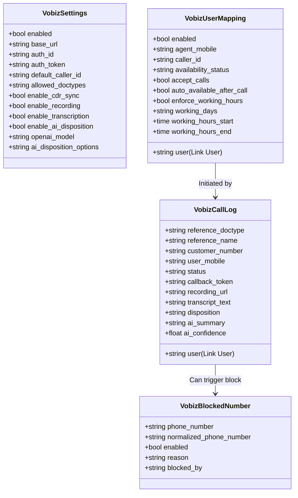
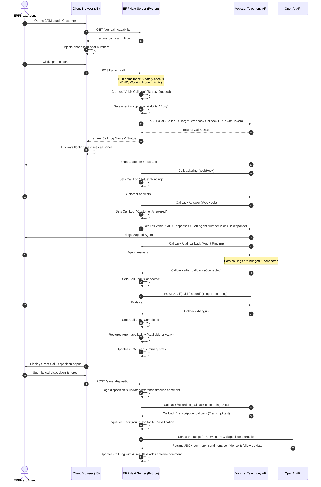

# Vobiz Click To Call — Application Analysis & Architecture

This document provides a comprehensive review of the **Vobiz Click To Call** integration app for Frappe/ERPNext. It analyzes the application flow, details its primary features, and provides critical observations along with architectural recommendations to enhance the product's security, flexibility, and reliability.

---

## 1. Application Overview & Objective

The **Vobiz Click To Call** application is a bridge connecting the **Vobiz.ai Telephony / VoIP platform** with **Frappe & ERPNext**. 
It simplifies and automates out-bound calling for sales and support agents:
1. **Initiation**: Agents click an icon adjacent to a phone number in supported CRM/ERP records (e.g., Leads, Customers, Contacts, Patients).
2. **Telephony Bridge**: Vobiz dials the customer's phone number first. 
3. **Agent Connection**: As soon as the customer answers, the Vobiz system makes a web request back to the Frappe app, which responds with dynamic XML instructions (`<Response><Dial>...</Dial></Response>`) telling Vobiz to dial the agent's mapped mobile phone, bridging the two lines.
4. **Automation & Insights**: The call is tracked end-to-end, optionally recorded and transcribed, and completed with automated AI summaries and manual disposition inputs.

---

## 2. System Architecture & Data Model

The application leverages Frappe's robust metadata engine and scheduled task manager. The data schema consists of four key Doctypes:



### DocType Breakdowns:
1. **`Vobiz Settings` (Single DocType)**: Global settings storing credentials (Auth ID, Auth Token), endpoints, rate limits, audio formats, OpenAI configuration keys, default dial flows, and allowed Doctypes.
2. **`Vobiz User Mapping` (Standard)**: Binds an active ERPNext `User` to their respective physical mobile number and personalized caller ID. Also holds user-level schedules (working hours, active days) and availability status.
3. **`Vobiz Blocked Number` (Standard)**: A global compliance lookup table for numbers listed on DND (Do Not Disturb) sheets or marked as Wrong Numbers, containing audit trails.
4. **`Vobiz Call Log` (Standard)**: Tracks every call. Records unique Call UUIDs, A/B leg status, call times, durations, costs, transcription texts, manual & AI dispositions, and raw webhook callbacks.

---

## 3. Operational Call Flow

The operational life cycle of a click-to-call operation spans frontend rendering, API execution, XML-based callback responses, recording management, and background database reconciliation:



---

## 4. Key Features Detailed

### A. Dynamic Availability Dashboard
- **Header Status Widget**: A dropdown is dynamically pre-pended to the ERP navbar (visible only to users mapped to a Vobiz account). Status options: *Available* (Green), *Busy* (Orange), *Away* (Yellow), and *Offline* (Gray).
- **Status Automation**:
  - Automatically transitions to **Busy** when an active call is initiated, blocking subsequent calls.
  - Automatically restores to **Available** or **Away** (based on configuration) when the hangup callback is received.

### B. Intelligent Phone Field Scraper
- **Universal Detection**: The client-side script parses meta-fields on loaded records. If it matches standard phone field names (`mobile_no`, `phone`, `whatsapp_no`, etc.), it appends a calling trigger button inline.
- **Table Support**: Automatically detects child tables containing phone fields (e.g. customized multi-contact grids) and appends individual call dials.
- **Bulk List Dials**: Integrates a "Vobiz Call Selected" button in record List views, facilitating rapid dialing workflows.

### C. Compliance & Safety Engine
- **Global Blacklist**: Cross-references numbers against the `Vobiz Blocked Number` index.
- **Field-level DND Flags**: Scrapes parent records for standard Do-Not-Call check fields (`vobiz_do_not_call`, `do_not_call`, `do_not_contact`). If checked, calls are programmatically blocked.
- **Limit Protections**: Enforces daily caps on how many times a single CRM reference can be called and how many daily calls an agent can place.
- **Time/Day Schedules**: Blocks outbound dials if they fall outside an agent's assigned working hours or days.

### D. Automated Post-Call Dialogues & Tasks
- **Instant Dialogue**: Once a call transitions to a terminal state (Completed, No Answer, Busy, Failed), a standard dialog prompts the agent to document the call.
- **Automatic Tasking**: If the agent records a follow-up date, the app automatically inserts an active **ToDo** record linked to the reference document.

### E. AI-Assisted CRM Entry
- **Transcript Extraction**: Integrates with OpenAI's large language models to process call recordings.
- **CRM Classification**: Evaluates transcript context to extract sentiment, core intent, next actions, and auto-suggested dispositions.
- **Manual Review Flag**: If the AI model's confidence rating falls below the configured threshold (e.g. 75%), it marks the call as `Review Required` for audit managers.

### F. Hourly CDR Reconciliation
- **Durable Cron Job**: Scheduled event (`sync_recent_cdrs`) runs hourly. It requests call data records directly from Vobiz for logs marked `Not Synced` or `Not Found`.
- **Reconciliation**: Fixes missing durations, costs, and recording links caused by interrupted network connections or lost webhook callbacks.

---

## 5. Implementation Critique & Architectural Suggestions

Upon deep analysis of the application codebase, several design flaws and potential points of failure were identified. Addressing these will significantly improve the system's scalability, maintainability, and reliability:

### Suggestion 1: Decouple Hardcoded Disposition Lists
> [!WARNING]
> **Issue**: Out-of-the-box manual call dispositions are hardcoded inside three different files: `api/disposition.py` (`get_disposition_options_api`), `public/js/click_to_call.js`, and `public/js/call_log.js`. 
>
> If an organization needs to customize call statuses (e.g., adding "Left Voicemail" or "Decision Maker Offline"), they must edit core python and javascript code.

- **Solution**: 
  1. Add a customizable multi-line text or Table field inside the `Vobiz Settings` DocType called `manual_disposition_options`.
  2. Modify `api/disposition.py` to pull options directly from `Vobiz Settings` (falling back to a default list if empty).
  3. Modify the dialog fields in the JS files to call this API endpoint dynamically instead of keeping static lists.

---

### Suggestion 2: Fix OpenAI Endpoint and Payload Call Signature
> [!CAUTION]
> **Issue**: In `services/ai.py` (lines 80–89), the OpenAI call is structured as:
> ```python
> response = requests.post(
>     "https://api.openai.com/v1/responses",
>     headers={"Authorization": f"Bearer {api_key}"...},
>     json={"model": settings.openai_model, "input": prompt}
> )
> ```
> This is a non-standard API structure. The official OpenAI Chat Completion endpoint is `https://api.openai.com/v1/chat/completions` and the required payload takes a `messages` array: `{"messages": [{"role": "user", "content": prompt}]}`. Calling the current endpoint directly against OpenAI will fail with a 404/400 error.

- **Solution**:
  1. Update `services/ai.py` to use `/v1/chat/completions`.
  2. Structure the payload to support standard completions:
     ```python
     payload = {
         "model": settings.openai_model or "gpt-4o-mini",
         "messages": [{"role": "user", "content": prompt}],
         "temperature": 0.2
     }
     ```
  3. Optionally, expose the complete endpoint URL as a field (`ai_api_endpoint`) in `Vobiz Settings` to support alternative API gateways (e.g., local LLM routers, Azure OpenAI, or custom proxy hubs).

---

### Suggestion 3: Implement Dynamic DocType Event Registration in JS
> [!IMPORTANT]
> **Issue**: In `public/js/click_to_call.js` (lines 15 and 551) and `public/js/list_dialer.js` (lines 2 and 8), the supported doctypes are statically hardcoded:
> ```javascript
> const DOCTYPES = ["CRM Lead", "Contact", "Patient", "Customer"];
> ```
> Although the system administrator can specify allowed Doctypes in `Vobiz Settings`, the Javascript listener events are only registered for these four hardcoded forms. If an administrator adds a custom doctype (e.g. "Telemarketing Prospect"), the click-to-call triggers will **never render** on that form.

- **Solution**:
  1. Boot-load the allowed doctypes list from the backend settings using Frappe's `bootinfo` hooks, or call a fast cached API at client startup.
  2. Loop through this dynamic list to call `registerDoctype(doctype)` during Javascript initialization.

---

### Suggestion 4: Refine Attempt Counts to Handle API Call Failures
> [!NOTE]
> **Issue**: In `api/call.py` (`start_call`), the Call Log record is inserted, and reference call metrics are updated **before** checking if the Vobiz API request succeeded. If the API client throws a network exception or returns an authentication error, the log is set to "Failed", but the record's attempt counters (`vobiz_total_call_attempts`) are incremented, potentially triggering false compliance blocks.

- **Solution**:
  1. Perform the Vobiz API request *before* saving/inserting the `Vobiz Call Log` doc or update metrics only when the telephony engine establishes a handshake (i.e. once status is confirmed as `Queued` or `Ringing`).
  2. If the API raises an early exception, delete the Call Log record or set a flag `exclude_from_metrics` so it does not skew compliance counters.

---

### Suggestion 5: Optimize Recording Trigger Handling
> [!TIP]
> **Issue**: The application triggers manual recording by making an outbound API call (`VobizClient.start_call_recording`) once the `dial_callback` or `dial_action` webhook receives a "Connected" state. This adds a network hop delay.
>
> If Vobiz supports initiating recordings directly during call setup via the initial `/Call` payload parameters, utilizing that parameters block would reduce webhook overhead.

- **Solution**:
  1. Check Vobiz API specifications to see if the call recording toggle can be supplied in the initial dialing `/Call` payload (e.g. `"record": true` or similar configuration).
  2. If supported, send the recording request in the initial startup block, completely eliminating the additional API request during connection.
